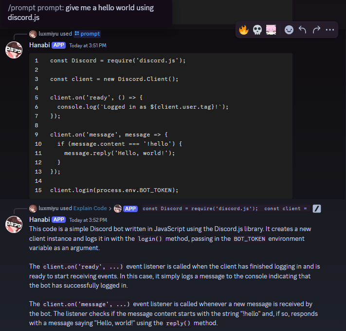
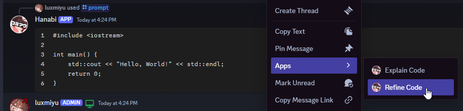
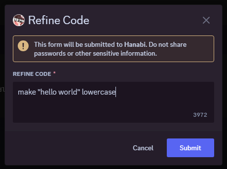
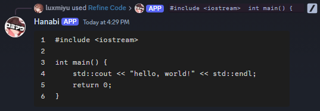

# Hanabi Bot



A simple and minimalist AI coding assistant Discord bot. Able to write, explain, and refine code.
From a text prompt or even an image using OCR. Using the /prompt and /image slash commands,
as well as the "Explain Code" and "Refine Code" right-click message context menu commands.

This is a college project.

Uses a `.env` file to store secrets.
```bash
BOT_TOKEN=
BOT_ID=
OPENAI_BASE_URL=
OPENAI_API_KEY=
```




